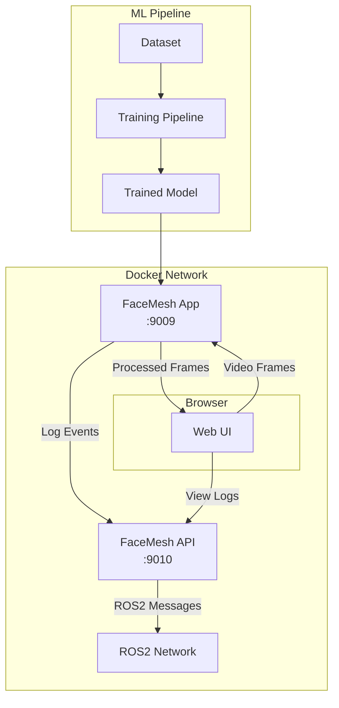

# FaceMesh Project

24/25 EVML students Kevin, Jaapjan, William, Enes

## Overview
The FaceMesh Project is a comprehensive system for facial expression recognition, leveraging MediaPipe's FaceMesh solution for accurate facial landmark detection and TensorFlow for machine learning model training and evaluation.

## Architecture Overview

### System Components


### Component Descriptions

1. **Web Application** (Port 9009)
   - Real-time facial landmark detection
   - WebRTC video feed processing
   - MediaPipe FaceMesh integration
   - Frame-by-frame analysis
   - Log forwarding to API
   - Dual video interface
   - Live landmark visualization

2. **API Service** (Port 9010)
   - ROS2 message publishing
   - WebSocket log streaming
   - Event aggregation
   - System monitoring
   - REST endpoints
   - Real-time data bridge

3. **Pipeline**
   - Dataset preprocessing
   - TensorFlow model training
   - Hyperparameter optimization
   - Performance monitoring
   - Model versioning
   - Automated training workflow

4. **SVM Pipeline**
   - Alternative ML approach
   - Linear SVM classification
   - Real-time emotion detection
   - Landmark standardization
   - Model evaluation metrics
   - Webcam/Image testing modes

5. **Supporting Services**
   - TensorBoard visualization
   - Docker containerization
   - ROS2 integration
   - WebSocket communication
   - Data persistence
   - Error handling

### Pipeline Overview

The pipeline consists of the following steps:

1.  Data capture
2.  Configuration
3.  Data loading and preprocessing
4.  File handling
5.  Model graph visualization
6.  Image preparation
7.  Model training
8.  Pipeline execution
9.  TensorBoard integration
10. Training callbacks

### Pipeline Data Flow

```mermaid
graph LR
    A[capture_facemesh_data.py: Capture Landmarks] --> B(data_load.py: Load & Preprocess Data)
    B --> C(imagePrep.py: Prepare Images)
    C --> D(model_train_hyperband_XLA_acceration_caching.py: Hyperband Training)
    D --> E(model_train_hyperparameters.py: Train with Hyperparameters)
    E --> F(graph_model.py: Visualize Model)
    F --> G(tensorboard_utils.py: TensorBoard Integration)
    G --> H(training_callbacks.py: Configure Callbacks)
    H --> I(run_pipeline.py: Orchestrate Pipeline)
```



### Pipeline Model Architecture

```mermaid
graph LR
    A[Input: (216,)] --> B(Conv1D: filters, kernel_size, activation)
    B --> C(MaxPooling1D: pool_size=2)
    C --> D(Conv1D: filters, kernel_size, activation)
    D --> E(MaxPooling1D: pool_size=2)
    E --> F(Flatten)
    F --> G(Dense: units, activation)
    G --> H(Output: num_classes, softmax)
```

### API Overview

The API service is responsible for receiving FaceMesh data, publishing it to a ROS2 network, and providing access to logs.

The API is built using Flask and Flask-SocketIO. It exposes a REST endpoint for receiving POST requests containing FaceMesh data. Upon receiving data, the API publishes it to a ROS2 topic named `facemesh_data` and emits a WebSocket event for real-time log updates.

### API Endpoints

*   `/` (POST): Receives FaceMesh data and publishes it to the ROS2 network.
*   `/logs` (GET): Retrieves the logs of received FaceMesh data.

### API Docker Instructions

```bash
docker build -t facemesh_api api/
docker run -d -p 9010:9010 facemesh_api
```

### Docker Deployment

```yaml
services:
  facemesh-api:
    hostname: api
    container_name: api
    ports:
      - "9010:9010"
    networks:
      - facemesh-network

  facemesh-app:
    hostname: app
    container_name: app
    ports:
      - "9009:9009"
    networks:
      - facemesh-network

networks:
  facemesh-network:
    driver: bridge
```

### Data Flow

1. **Video Processing**
   ```
   Browser -> App -> MediaPipe -> Browser
   ```
   - Camera feed capture
   - Frame preprocessing
   - Landmark detection
   - Visualization overlay

2. **Logging Pipeline**
   ```
   App -> API -> ROS2
   ```
   - Event generation
   - Log aggregation
   - ROS2 publishing
   - WebSocket streaming

3. **Model Pipeline**
   ```
   Dataset -> Training -> Model -> Application
   ```
   - Data preparation
   - Model training
   - Evaluation
   - Deployment

### Technology Stack

1. **Frontend**
   - HTML5/JavaScript
   - WebRTC
   - Canvas API
   - WebSocket

2. **Backend**
   - Python 3
   - Flask
   - OpenCV
   - MediaPipe

3. **Machine Learning**
   - TensorFlow
   - Keras
   - NumPy
   - Pandas

4. **Infrastructure**
   - Docker
   - ROS2 Humble
   - WebSocket
   - RESTful API

## Pipeline Documentation

### Configuration (config.py)

The configuration module provides centralized settings management through the `Config` class. All configuration parameters are automatically initialized and necessary directories are created on instantiation.

#### Core Settings

1. **General Configuration**
   ```python
   VERBOSE = 1                  # Output verbosity level
   TIMESTAMP = 'YYYY-MM-DD_HH-MM-SS'  # Auto-generated timestamp
   RANDOM_STATE = 42           # Seed for reproducibility
   ```

2. **Data Parameters**
   ```python
   IMAGE_DIMS = (240, 320)     # Input image dimensions
   VALIDATION_SPLIT = 0.2      # Train/validation split ratio
   NUM_CLASSES = 5             # Number of expression classes
   INPUT_SHAPE = (216,)        # Model input features
   ```

3. **Training Configuration**
   ```python
   EPOCHS = 50                 # Maximum training epochs
   BATCH_SIZE = 8             # Training batch size
   SHOULD_SHUFFLE = False     # Dataset shuffling
   SHOULD_BATCH = True        # Enable batching
   MAX_TRIALS = 1000         # Maximum tuning trials
   ```

#### File Structure Management
```python
# Base directories
OUTPUT_DIRECTORY = 'output'
DATA_DIR = 'dataset'

# Input/Output paths
IMAGE_DIR = os.path.join(DATA_DIR)
OUTPUT_DIR = os.path.join(OUTPUT_DIRECTORY)
MODEL_DIR = os.path.join(OUTPUT_DIR, 'model')
HISTORY_DIR = os.path.join(OUTPUT_DIR, 'history')
LOGS_DIR = os.path.join(OUTPUT_DIR, 'logs')
LANDMARKS_DIR = os.path.join(OUTPUT_DIR, 'landmarks')
```

#### Component-Specific Settings

1. **TensorBoard Configuration**
   - Port: 6006
   - Update frequency: 'epoch'
   - Histogram frequency: 1
   - Graph/Image writing enabled
   - Profile batch: 2
   - Embeddings frequency: 1

2. **FaceMesh Settings**
   ```python
   FACE_MESH_STATIC_MODE = True
   FACE_MESH_MIN_DETECTION_CONFIDENCE = 0.5
   FACE_MESH_MIN_TRACKING_CONFIDENCE = 0.5
   ```

3. **Hyperparameter Tuning**
   ```python
   HP_TUNER_MAX_TRIALS = 1000
   HP_TUNER_OBJECTIVE = 'val_loss'
   HP_TUNER_EPOCHS_MAX = 50
   
   # Network parameters
   HP_TUNER_LAYERS: (1, 1, 1)      # (min, max, step)
   HP_TUNER_UNITS: (32, 256, 32)
   HP_TUNER_DROPOUT: (0.1, 0.5, 0.1)
   
   # Regularization
   HP_TUNER_L1: (0.0001, 0.01, 0.0001)
   HP_TUNER_L2: (0.0001, 0.01, 0.0001)
   ```

### Data Loading Pipeline (data_load.py)

The data loading module handles dataset preparation, including facial landmark detection, preprocessing, and conversion to TensorFlow datasets.

#### Key Components

1. **FaceMesh Integration**
   ```python
   def load_face_mesh():
       """Initialize MediaPipe FaceMesh instance"""
       global mp_face_mesh
       if mp_face_mesh is None:
           mp_face_mesh = mp.solutions.face_mesh
       return mp_face_mesh
   ```

2. **Landmark Detection**
   ```python
   def get_landmarks(img):
       """Extract facial landmarks from image"""
       with face_mesh.FaceMesh(
           static_image_mode=config.FACE_MESH_STATIC_MODE,
           min_detection_confidence=config.FACE_MESH_MIN_DETECTION_CONFIDENCE
       ) as face_detector:
           results = face_detector.process(img)
           return results.multi_face_landmarks
   ```

#### Data Processing Pipeline

1. **Image Loading and Processing**
   ```python
   def images_to_landmarks(image_dir):
       """Process images to extract landmarks"""
       # Supports JPG, JPEG, PNG formats
       # Extracts 468 facial landmarks (x,y,z)
       # Returns DataFrame with features
   ```

2. **Data Cleaning**
   ```python
   def detect_outliers(df, contamination=0.05):
       """Remove outliers using Isolation Forest"""
   
   def filter_zero_landmarks(df):
       """Remove samples with zero-value landmarks"""
   
   def filter_facial_features(df):
       """Extract specific facial features"""
       # Eyes, eyebrows, mouth landmarks
   ```

3. **Dataset Creation**
   ```python
   def dataframe_to_dataset(df):
       """Convert DataFrame to TensorFlow Dataset"""
       # One-hot encode labels
       # Convert to tf.data.Dataset format
       # Returns dataset and encoded labels
   ```

#### Data Visualization
```python
def visualize_landmarks(df, sample_idx=5):
    """3D visualization of facial landmarks"""
    # Extract coordinates
    # Create 3D scatter plot
    # Highlight key points
```

#### Key Features

1. **Automatic Processing**
   - CSV caching of landmarks
   - Automatic reprocessing if needed
   - Progress tracking and logging

2. **Data Validation**
   - Shape verification
   - Feature extraction validation
   - Dataset cardinality checks

3. **Preprocessing Pipeline**
   - RGB color space conversion
   - Landmark normalization
   - Feature selection
   - Dataset batching and shuffling

4. **Output Formats**
   - CSV storage of landmarks
   - TensorFlow dataset format
   - One-hot encoded labels
   - Batch-ready data structures

### File Handling (fileHandler.py)

#### Overview
The file handling module provides utilities for managing dataset files and output directories. It handles image file discovery, output directory creation, and CSV file management for facial landmark data.

#### Key Functions

1. **load_files(data_path=None)**
   - Purpose: Load all dataset image files
   - Parameters:
     - `data_path`: Optional path to dataset directory (defaults to "dataset" in project root)
   - Features:
     - Supports multiple image formats (PNG, JPG, JPEG)
     - Recursive directory scanning
     - File count reporting
   - Returns: List of file paths

2. **create_output_dir()**
   - Purpose: Create timestamped output directory
   - Features:
     - Generates unique directory name using current timestamp
     - Creates directory in project's output folder
     - Format: "YYYY-MM-DD_HH-MM-SS"
   - Returns: Path to created directory

3. **create_facemesh_csv(output_path)**
   - Purpose: Set up CSV file for facial landmark data
   - Parameters:
     - `output_path`: Directory path for the CSV file
   - Returns: Path to facemesh_landmarks.csv file

### Image Preparation (imagePrep.py)

#### Overview
The image preparation module provides utilities for processing facial images, including grayscale conversion, face detection, normalization, and facial landmark visualization. It works in conjunction with MediaPipe FaceMesh for landmark detection and OpenCV for image processing.

#### Key Functions

1. **grayscale_image(img)**
   - Purpose: Convert BGR image to grayscale
   - Parameters:
     - `img`: Input image in BGR format
   - Returns: Grayscale version of input image

2. **crop_face(img)**
   - Purpose: Detect and crop face from grayscale image
   - Features:
     - Uses Haar Cascade Classifier for face detection
     - Resizes cropped face to 512x512
   - Parameters:
     - `img`: Grayscale input image
   - Returns: Cropped and resized face image, or None if no face detected

3. **normalize_image(img)**
   - Purpose: Enhance image contrast
   - Features:
     - Uses CLAHE (Contrast Limited Adaptive Histogram Equalization)
     - Parameters: clipLimit=2.0, tileGridSize=(8,8)
   - Parameters:
     - `img`: Input grayscale image
   - Returns: Contrast-enhanced image

4. **preview_landmarks(img, landmarks)**
   - Purpose: Visualize facial landmarks on image
   - Features:
     - Draws full face mesh tesselation
     - Highlights eyes and mouth in green
     - Uses MediaPipe drawing utilities
   - Parameters:
     - `img`: RGB/BGR image
     - `landmarks`: MediaPipe face landmarks

5. **save_facemesh(filename, class_name, landmarks, facemesh_csv_path)**
   - Purpose: Save facial landmarks to CSV
   - Features:
     - Stores x, y, z coordinates for each landmark
     - Includes filename and class information
     - Appends to existing CSV or creates new one
   - Parameters:
     - `filename`: Source image path
     - `class_name`: Expression class label
     - `landmarks`: MediaPipe face landmarks
     - `facemesh_csv_path`: Output CSV path

#### Processing Pipeline
1. Load image files using fileHandler
2. Process each image:
   - Extract facial landmarks (not implemented in this file)
   - Convert to grayscale
   - Optional face cropping
   - Apply contrast normalization
   - Save processed image

### Hyperparameter Tuning (hp_model_tuner.py)

#### Overview
The hyperparameter tuning module implements Bayesian optimization for finding optimal model architectures and training parameters. It uses KerasTuner for hyperparameter search and integrates with TensorBoard for visualization of the tuning process.

#### Key Components

1. **Model Architecture Search Space**
   - Input normalization options:
     - Standard normalization
     - Layer normalization
     - Batch normalization
     - No normalization
   - Network depth: 2-5 layers
   - Layer configuration per layer:
     - Units: 32-512 (step=32)
     - Optional batch normalization
     - Activation: relu, tanh, selu, leaky_relu
     - Dropout rate: 0.0-0.5 (step=0.1)
   - Optimizer selection:
     - Adam
     - RMSprop
     - SGD

2. **build_model(hp) Function**
   - Purpose: Construct model with tunable parameters
   - Features:
     - Dynamic layer creation
     - Configurable normalization
     - Flexible architecture
     - Optimizer selection
   - Parameters:
     - `hp`: KerasTuner hyperparameter object
   - Returns: Compiled Keras model

#### Tuning Process

1. **Setup Phase**
   - Load training and validation datasets
   - Create versioned output directory
   - Initialize Bayesian optimization tuner
   - Configure TensorBoard monitoring

2. **Search Phase**
   - Maximum 500 trials
   - Optimization objective: validation accuracy
   - Early stopping for inefficient trials
   - Progress tracking via TensorBoard

3. **Results Management**
   - Best hyperparameters saved to file
   - Model architecture visualization
   - Performance metrics logging
   - Trial history preservation

#### TensorBoard Integration
- Real-time monitoring of trials
- Hyperparameter importance visualization
- Training metrics comparison
- Model architecture graphs

### TensorBoard Integration (tensorboard_utils.py)

#### Overview
The TensorBoard utilities module provides functionality for logging, visualizing, and monitoring model training progress. It configures TensorBoard callbacks, manages log directories, and handles the TensorBoard server startup process.

#### Key Functions

1. **create_tensorboard_callback()**
   - Purpose: Configure TensorBoard callback for model training
   - Features:
     - Histogram frequency configuration
     - Graph visualization options
     - Image logging settings
     - Update frequency control
     - Profiling configuration
     - Embeddings visualization
   - Returns: Configured TensorBoard callback

2. **create_log_dir(model_dir)**
   - Purpose: Create timestamped log directory
   - Parameters:
     - `model_dir`: Base directory for model artifacts
   - Features:
     - Timestamp-based directory naming
     - Automatic directory creation
   - Returns: Path to created log directory

3. **start_tensorboard()**
   - Purpose: Launch TensorBoard server
   - Features:
     - Runs in separate daemon thread
     - Automatic browser opening
     - Configurable port
     - Log directory monitoring
   - Returns: TensorBoard thread object

#### Configuration Options
- Histogram frequency
- Graph writing
- Image logging
- Update frequency
- Profiling batches
- Embeddings visualization frequency
- Port number
- Log directory path

#### Monitoring Features
- Real-time training metrics
- Learning rate changes
- Model graph visualization
- Layer activation histograms
- Training/validation comparison
- System resource utilization
- Custom metric logging

### Training Callbacks (training_callbacks.py)

#### Overview
The training callbacks module provides a comprehensive set of Keras callbacks for monitoring, controlling, and logging the model training process. These callbacks handle model checkpointing, early stopping, learning rate adjustment, and training history logging.

#### Callback Components

1. **ModelCheckpoint**
   - Purpose: Save model weights during training
   - Features:
     - Monitors validation loss
     - Saves best-performing model
     - Configurable save frequency
     - Initial threshold: 0.8
   - Path: Configured through MODEL_CHECKPOINT_PATH

2. **EarlyStopping**
   - Purpose: Prevent overfitting by stopping training
   - Configuration:
     - Monitor: validation loss
     - Patience: 6 epochs
     - Minimum delta: 0.01
     - Starts monitoring: epoch 10
     - Restores best weights automatically

3. **TensorBoard**
   - Purpose: Training visualization and monitoring
   - Features:
     - Step timing metrics
     - Configurable update frequency
     - Integration with TensorBoard server

4. **ReduceLROnPlateau**
   - Purpose: Dynamic learning rate adjustment
   - Configuration:
     - Monitor: validation loss
     - Minimum delta: 0.1
     - Reduction factor: 0.1
     - Patience: 3 epochs
     - Minimum learning rate: 1e-6

5. **CSVLogger**
   - Purpose: Save training history to CSV
   - Features:
     - Comma-separated format
     - New file per training run
     - Complete metric history

6. **TerminateOnNaN**
   - Purpose: Safety check for numerical stability
   - Stops training if NaN values detected

#### Training Monitoring
- Automatic model checkpointing
- Early stopping on performance plateau
- Dynamic learning rate adjustment
- Comprehensive metric logging
- Training progress visualization
- Numerical stability checks

### Model Training (model_train.py)

#### Overview
The model training module implements the core neural network architecture, training pipeline, and model management functionality. It handles dataset preparation, model creation, training execution, and artifact management.

#### Key Components

1. **Dataset Preparation**
   ```python
   def prepare_datasets(df, batch_size=16, train_split=0.8, random_seed=42)
   ```
   - Features:
     - Label encoding for classes
     - Train/validation splitting
     - Dataset caching and prefetching
     - Batch size configuration
   - Returns: Training and validation TensorFlow datasets

2. **Model Architecture**
   ```python
   def create_model(feature_columns, num_classes)
   ```
   - Input layer per facial landmark feature
   - Normalization layer
   - Dense layers with configurations:
     - Layer 1: 128 units
     - Layer 2: 256 units
     - Layer 3: 128 units
   - Each dense layer includes:
     - Batch normalization
     - ReLU activation
     - 30% dropout
   - Softmax output layer
   - Adam optimizer
   - Sparse categorical crossentropy loss

3. **Model Management**
   - Version control for model artifacts:
     - Automatic version numbering
     - Timestamp-based directories
     - Model checkpointing
     - Architecture visualization
   - Performance tracking:
     - Training/validation metrics
     - Model descriptions
     - Best model preservation

4. **Custom Components**

   a. **BestModelCheckpoint**
   - Tracks best validation accuracy
   - Saves models with accuracy in filename
   - Maintains single best model
   - Cleanup of older checkpoints

   b. **Versioning System**
   ```python
   def create_versioned_dir(output_path)
   ```
   - Incremental version numbers
   - Timestamp integration
   - Organized output structure

#### Training Process

1. **Initialization**
   - Load latest landmark data
   - Configure environment
   - Set random seeds
   - Initialize TensorFlow backend

2. **Data Preparation**
   - Load landmark CSV
   - Drop unnecessary columns
   - Split into train/validation
   - Create TensorFlow datasets

3. **Model Setup**
   - Create neural network
   - Configure callbacks
   - Initialize TensorBoard
   - Prepare output directories

4. **Training Execution**
   - Maximum 500 epochs
   - Early stopping conditions
   - Learning rate adjustment
   - Progress monitoring
   - Model checkpointing

5. **Artifact Management**
   - Save best model
   - Generate descriptions
   - Store performance metrics
   - Archive training history

#### Output Structure
```
output/
└── v1_20250209_222359/
    ├── model.keras
    ├── model_description.txt
    ├── best_model_acc_0.9234.keras
    └── logs/
        └── 20250209-222359/
            └── train/
```

### Pipeline Entry Points (main.py, main2.py)

#### Overview
The pipeline provides two entry points with different model architectures and hyperparameter tuning approaches. Both implement end-to-end training pipelines using the FaceMesh landmark features.

#### Main Implementations

1. **main.py**
   - Features:
     - 1D Convolutional architecture
     - Tunable layer count and configurations
     - Dynamic pooling strategy (max or average)
     - Flexible optimization settings
   
   ```python
   def create_model_tuned(hp):
   ```
   - Tunable Parameters:
     - Number of convolutional layers
     - Filters per layer (32-512)
     - Activation functions
     - Dropout rates
     - Pooling methods
     - Optimizer selection

2. **main2.py**
   - Features:
     - Enhanced CNN architecture
     - Batch normalization
     - Structured layer organization
     - Improved hyperparameter ranges
   
   ```python
   def create_model_tuned(hp, input_shape=(216,), num_classes=5):
   ```
   - Tunable Parameters:
     - Layer count (configurable range)
     - Conv1D filters (32-256)
     - Dense layer units (64-256)
     - Dropout rate (0.2-0.5)
     - Learning rate (1e-2 to 1e-4)
     - Optimizer (Adam/RMSprop)

#### Common Features

1. **Dataset Handling**
   - Load train/validation datasets
   - Shape verification
   - Input preprocessing
   - Label management

2. **Model Management**
   - TensorBoard integration
   - Callback configuration
   - Model saving
   - Hyperparameter logging

3. **Training Process**
   - Bayesian optimization
   - Early stopping
   - Learning rate adjustment
   - Progress monitoring

#### Key Differences

1. **Architecture**
   - main.py: Flexible pooling, simpler structure
   - main2.py: Fixed pooling, batch normalization, structured layers

2. **Hyperparameters**
   - main.py: Broader parameter ranges
   - main2.py: More focused ranges, learning rate tuning

3. **Output Management**
   - main.py: Basic model saving
   - main2.py: JSON hyperparameter export

4. **Model Building**
   - main.py: Direct model construction
   - main2.py: Lambda function approach for flexibility

#### Output Structure
```
output/
├── hyperparameter_tuning/
│   ├── trial_0/
│   ├── trial_1/
│   └── ...
├── model_best.keras
└── best_hyperparameters.json
```

## API Documentation

### Overview
The API service provides a bridge between the FaceMesh system and ROS2 (Robot Operating System 2), implementing a web interface for real-time data streaming and visualization. It uses Flask and WebSocket for real-time communication and ROS2 for data publishing.

### Components

#### Web Server (app.py)
- Flask application with SocketIO integration
- ROS2 node implementation
- Real-time log streaming
- REST endpoints for data handling

```python
def ros2_spin(node):
    rclpy.spin(node)  # ROS2 event loop

class ROS2Node(Node):
    def __init__(self):
        super().__init__('facemesh_publisher')
        self.publisher_ = self.create_publisher(String, 'facemesh_data', 10)
```

#### Endpoints

1. **Root Endpoint** (`/`)
   - Methods: GET, POST
   - GET: Returns web interface
   - POST: Publishes data to ROS2
   ```python
   @app.route('/', methods=['POST', 'GET'])
   def handle_request():
       # Handles both web interface and data publishing
   ```

2. **Logs Endpoint** (`/logs`)
   - Method: GET
   - Returns: JSON array of logged messages
   ```python
   @app.route('/logs', methods=['GET'])
   def get_logs():
       return jsonify(logs), 200
   ```

#### Web Interface (index.html)
- Real-time log visualization
- WebSocket connection for live updates
- Responsive design
- Auto-scrolling log display

```html
<script>
    const socket = io();
    socket.on('log_update', (data) => {
        logContainer.innerHTML += data + '<br>';
        logContainer.scrollTop = logContainer.scrollHeight;
    });
</script>
```

### Dependencies
```
flask
flask-socketio
```

### Docker Configuration
```dockerfile
# api/Dockerfile
FROM ros:humble

WORKDIR /app
COPY requirements.txt .
RUN pip install -r requirements.txt

COPY . .
EXPOSE 9010

ENTRYPOINT ["/app/ros_entrypoint.sh"]
CMD ["python3", "app.py"]
```

### Usage

1. **Start the API Service**
   ```bash
   docker-compose up api
   ```

2. **Access Web Interface**
   - URL: http://localhost:9010
   - Shows real-time log stream
   - Auto-updates via WebSocket

3. **Publish Data**
   ```bash
   curl -X POST -d "your_data" http://localhost:9010/
   ```

4. **Retrieve Logs**
   ```bash
   curl http://localhost:9010/logs
   ```

### Implementation Details

1. **ROS2 Integration**
   - Publisher node: 'facemesh_publisher'
   - Topic: 'facemesh_data'
   - Message type: std_msgs/String
   - Queue size: 10

2. **WebSocket Events**
   - 'connect': Initial connection
   - 'log_update': New log data
   - Auto-reconnection enabled

3. **Threading**
   - ROS2 spin in separate thread
   - Main thread for Flask server
   - Daemon thread for cleanup

4. **Error Handling**
   - Werkzeug logging set to ERROR
   - Empty data validation
   - Thread cleanup on shutdown

### Development Notes
- Port 9010 must be available
- Requires ROS2 Humble
- WebSocket for real-time updates
- Containerized deployment

## Web Application Documentation

### Overview
MeshExpress is a web application that provides real-time facial landmark detection and visualization using MediaPipe FaceMesh. It features a dual-view interface showing both the original webcam feed and processed video with facial landmarks overlay.

### Components

#### Web Server (app.py)
```python
class HTTPHandler(logging.Handler):
    def emit(self, record):
        # Forward logs to API service
        requests.post('http://api:9010', data=log_entry)

@app.route('/video_feed', methods=['POST'])
def video_feed():
    # Process incoming video frames
    # Returns processed frames with landmarks
```
- Flask application with video processing
- Custom logging to API service
- Frame-by-frame processing
- Real-time response handling

#### Frame Processing (frame_editor.py)

1. **Face Detection**
   ```python
   mp_face_mesh = mp.solutions.face_mesh
   face_mesh = mp_face_mesh.FaceMesh()
   ```
   - MediaPipe FaceMesh integration
   - Tracked facial features:
     - Lips
     - Left/Right eyebrows
     - Left/Right eyes

2. **Landmark Detection**
   ```python
   def get_landmarks(frame):
   ```
   - RGB color space conversion
   - Feature extraction
   - Coordinate normalization
   - Returns dictionary of facial features

3. **Frame Manipulation**
   ```python
   def manipulate_frame(frame):
   ```
   - Landmark visualization
   - Green circle markers
   - Error logging for missing faces
   - Frame annotation

#### Web Interface (index.html)

1. **Layout**
   - Dual video container
   - Original feed display
   - Processed feed display
   - Responsive design

2. **Video Processing**
   ```javascript
   const sendFrame = () => {
       canvas.toBlob(blob => {
           fetch('/video_feed', { method: 'POST', body: blob })
       });
   };
   ```
   - 40ms frame interval
   - JPEG compression
   - Blob data transfer
   - Dynamic URL management

### Implementation Details

1. **Video Pipeline**
   - getUserMedia API access
   - Canvas-based frame capture
   - Blob conversion
   - Asynchronous processing

2. **Facial Feature Tracking**
   - 468 facial landmarks
   - Specialized feature groups:
     ```python
     FACIAL_FEATURES = [
         mp_face_mesh.FACEMESH_LIPS,
         mp_face_mesh.FACEMESH_LEFT_EYEBROW,
         mp_face_mesh.FACEMESH_RIGHT_EYEBROW,
     ]
     ```

3. **Error Handling**
   - Face detection validation
   - Frame decoding checks
   - Logging with rate limiting
   - Error response formatting

### Usage

1. **Start the Application**
   ```bash
   docker-compose up application
   ```

2. **Access Interface**
   - URL: http://localhost:9009
   - Allow camera access
   - View real-time processing

3. **Development Setup**
   ```bash
   # Install dependencies
   pip install -r application/requirements.txt

   # Run development server
   python application/app.py
   ```

### Technical Specifications

1. **Video Configuration**
   - Resolution: 1280x720 (ideal)
   - Frame rate: 25 fps (40ms interval)
   - Format: JPEG compression

2. **System Requirements**
   - WebRTC-compatible browser
   - Camera access
   - MediaPipe support
   - OpenCV processing

3. **Network Configuration**
   - Port: 9009
   - HTTP POST for frames
   - Binary data transfer
   - Cross-origin disabled

### Development Notes
- Debug mode enabled
- All-IP binding (0.0.0.0)
- Real-time processing optimization
- Memory management for frame buffers

## SVM Implementation Documentation

### Training Process

1. **Data Preparation**
   ```python
   # Load and preprocess landmark data
   X = df.drop(columns=['filename', 'hash', 'Label'])
   y = df['Label']
   
   # Encode labels and scale features
   label_encoder = LabelEncoder()
   scaler = StandardScaler()
   ```

2. **Model Configuration**
   ```python
   svm_model = SVC(
       kernel='linear',
       C=1.0,
       random_state=42
   )
   ```

### Usage

1. **Training Mode**
   ```bash
   cd SVM
   python train.py
   ```
   - Loads landmark dataset
   - Trains SVM classifier
   - Outputs performance metrics
   - Saves model artifacts

2. **Testing Mode**
   ```bash
   python Test.py
   ```
   - Supports two modes:
     - Webcam: Real-time detection
     - Image: Single image analysis
   - Displays emotion predictions
   - Visualizes facial landmarks

### Implementation Details

1. **Feature Processing**
   - Standardization of landmarks
   - Label encoding for emotions
   - Train/test split (80/20)
   - Data validation checks

2. **Visualization**
   ```python
   def draw_landmarks(frame, landmarks, connections):
       """Draw facial feature landmarks on frame"""
   
   FACIAL_FEATURES = [
       mp_face_mesh.FACEMESH_LIPS,
       mp_face_mesh.FACEMESH_LEFT_EYEBROW,
       mp_face_mesh.FACEMESH_RIGHT_EYEBROW,
   ]
   ```

3. **Error Handling**
   - File loading validation
   - Face detection checks
   - Error logging system
   - Graceful fallbacks

### Performance Metrics
- Training accuracy logging
- Test set evaluation
- Classification report
- Per-class metrics

### Development Notes
- Supports multiple input modes
- Real-time processing capabilities
- Configurable logging levels
- Extensible feature set
